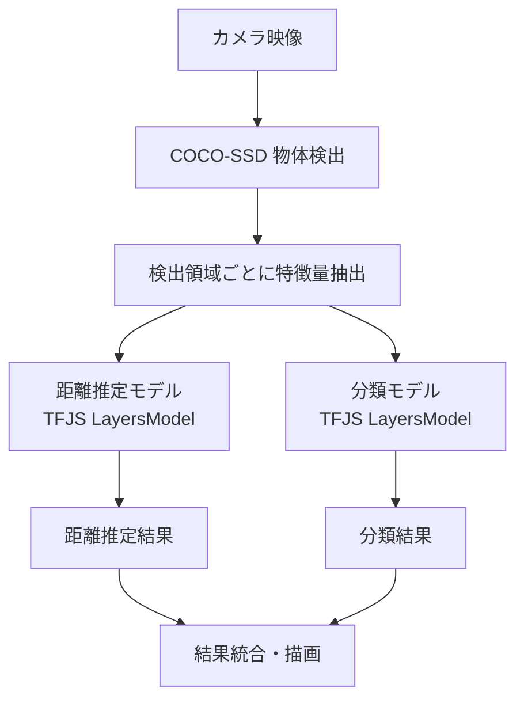

# RC System Overview

## System Architecture



## Components

### 1. 検出
- **COCO-SSD**: TensorFlow.js で動作する汎用物体検出モデル
- 入力: カメラ映像
- 出力: 検出された物体のバウンディングボックスとクラス

### 2. 特徴量抽出
- **面積**: 検出領域のピクセル数
- **HSV色相**: 検出領域の平均色相（0-180°）

### 3. カスタム推論モデル

#### 距離推定モデル
- **アーキテクチャ**: Sequential (Dense 64 → Dense 32 → Dense 1)
- **入力**: 面積（スケーリング済み: 100-20000）
- **出力**: 推定距離（メートル）
- **学習データ**: rc_system.py のルールベースロジックを模倣

#### 分類モデル
- **アーキテクチャ**: Sequential (Dense 64 → Dense 32 → Dense 4)
- **入力**: 面積 + 色相 + 彩度 + 明度（4次元）
- **出力**: 4クラスの確率分布
- **クラス**: 大型車両、車両、危険物、一般物体

### 4. 結果統合
- 検出された各物体に対して、距離と分類結果を統合
- 危険距離（< 3.0m）の場合は警告表示

## 推論結果ログ

<!-- ここから下に推論結果が追記される -->

### 推論ログフォーマット
```
時刻 | COCOクラス | 面積 | 推定距離 | 分類結果 | 信頼度
```

### 最新結果
- 初回実行待ち...

---

## 使い方

1. モデル選択
   - 距離モデル: プルダウンから選択
   - 分類モデル: プルダウンから選択

2. 推論実行
   - カメラを起動
   - COCO-SSD で物体検出
   - カスタムモデルで距離・分類を推定

3. 結果確認
   - リアルタイムで枠とラベルを表示
   - overview.mmd に結果を記録

## 技術仕様

- **フレームワーク**: TensorFlow.js 4.22.0
- **モデル形式**: LayersModel (Keras v3.13.2 から変換）
- **推論間隔**: 50ms 以上で設定可能（デフォルト 500ms）
- **入力解像度**: 640x480px
- **ブラウザ**: Chrome/Edge/Firefox (WebRTC 対応)